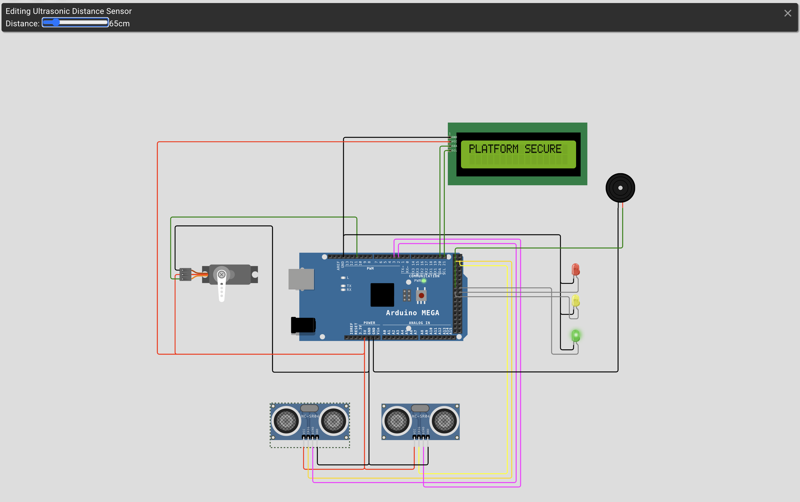
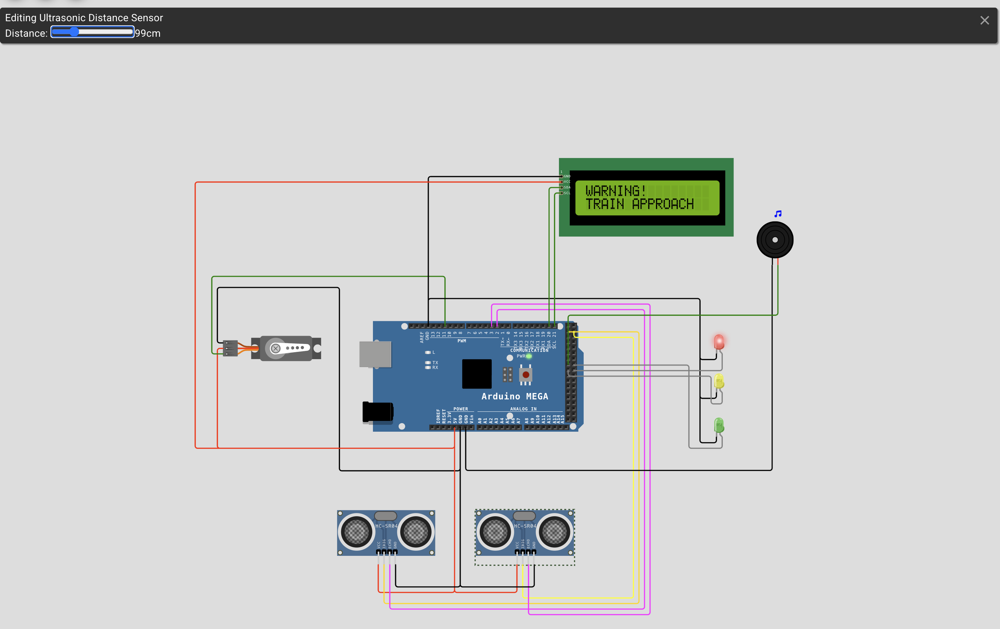
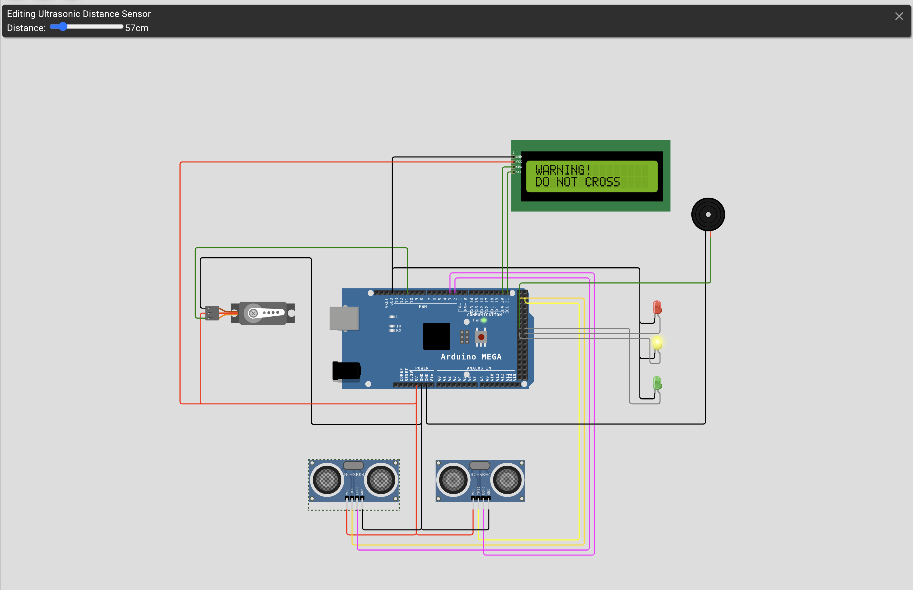
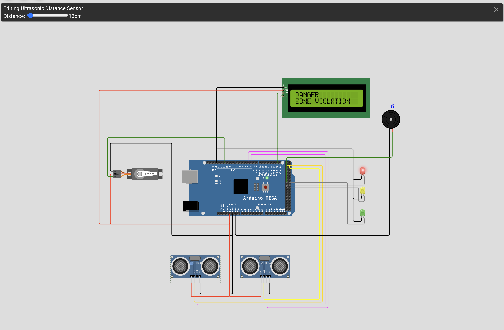

<h1 align="center">
  Smart Metro Platform Safety Barrier
</h1>

  Real-time embedded metro safety system using AVR C, Arduino Mega, ultrasonic sensors, interrupts, timers, and servo-controlled barriers.

  
  
  

## Problem Definition

Metro stations are areas where heavy pedestrian traffic and high-speed trains converge, creating a high concentration of potential hazards. These areas present serious safety risks, such as passengers falling from platforms onto the tracks or approaching dangerous zones.

Such incidents not only result in individual injury and fatalities but also cause disruptions and delays to metro operations and raise public concern.

Human factors such as psychological state, sleep deprivation, fatigue, and inattention significantly reduce the effectiveness of traditional safety measures at stations because current systems are not sufficiently effective in preventing passengers from approaching or falling into hazardous areas.

This highlights the need for a physical barrier to be activated in emergencies together with a comprehensive visual and auditory warning mechanism.

The main problems that the project seeks to solve are:

- Insufficient passive security measures
- Lack of real-time decision support mechanisms
- Awareness problems in noisy or low-visibility environments

These problems gave rise to the idea of developing a Smart Metro Platform Security Barrier.

## Project Goal

The primary goal of the project is to improve passenger safety in metro stations using a modern real-time embedded system.

The system combines:

- Ultrasonic distance sensors
- Servo motor-driven physical barriers
- LED warning indicators
- LCD feedback system
- Audible buzzer alerts

Using real-time proximity analysis, the system can detect approaching trains and dangerous passenger movements, automatically activating safety mechanisms and warning interfaces when necessary.

## Hardware Components

| Type    | I/O Device                 | Purpose of Usage                                                                                                |
| ------- | -------------------------- | --------------------------------------------------------------------------------------------------------------- |
| Display | LED / RGB LED              | To provide instant visual feedback on system status (Green: Safe, Yellow: Warning, Red: Danger).                |
| Display | LCD Display                | To provide real-time safety instructions, emergency warnings, and platform status messages to guide passengers. |
| Sensor  | Ultrasonic Distance Sensor | To monitor the distance of passengers from the safety line and detect the arrival of metro vehicles.            |
| Output  | Buzzer                     | To provide auditory alerts for both zone violations and approaching metro conditions.                           |
| Output  | Servo Motor                | To simulate the physical safety barrier that automatically opens or closes depending on the safety condition.   |

## System Threshold Logic

| Condition         | Threshold                                              | System Response                                  |
| ----------------- | ------------------------------------------------------ | ------------------------------------------------ |
| Platform Secure   | Passenger distance > 60 cm and metro distance > 100 cm | Barrier opens, green LED becomes active          |
| Train Approaching | Metro distance < 100 cm                                | Barrier closes, red LED and buzzer become active |
| Train Arrived     | Metro distance < 15 cm                                 | Barrier opens, green LED becomes active          |
| Warning Zone      | Passenger distance < 60 cm                             | Barrier closes, yellow LED becomes active        |
| Zone Violation    | Passenger distance < 50 cm                             | Barrier closes, red LED and buzzer become active |

## System Runtime States

### 1. Platform Secure State

  

_"Platform Secure" state. Safe distances are maintained; Green LED is ON, buzzer is OFF, and the barrier is open._

### 2. Train Approach Warning State

  

_"Train Approach" warning state (metro distance < 100 cm, e.g., at 99 cm). Red LED and buzzer are ON, and the barrier is closed._

### 3. Train Arrived Boarding State

  

_"Train Arrived" boarding state (metro distance < 15 cm, e.g., at 2 cm). Green LED is ON, buzzer is OFF, and the barrier is open._

### 4. DO NOT CROSS Warning State

  

_"DO NOT CROSS" warning state (passenger distance < 60 cm, e.g., at 57 cm). Yellow LED is ON, buzzer is OFF, and the barrier is closed._

### 5. Zone Violation Critical Danger State

  

_"ZONE VIOLATION" critical danger state (passenger distance < 50 cm, e.g., at 13 cm). Red LED and buzzer are ON, and the barrier is closed._

## Why Arduino Mega 2560?

The Arduino Mega 2560 was selected because the system requires simultaneous real-time sensor processing, interrupt management, PWM generation, and multiple peripheral connections.

Within the project architecture:

- Timer1 is used to generate a stable 50Hz PWM signal for precise servo motor control
- Timer3 is configured for high-resolution ultrasonic distance measurement
- External interrupts (INT4 / INT5) are used for real-time echo signal capture
- I2C communication is utilized for synchronized LCD updates
- Hysteresis-based threshold stabilization is implemented to prevent unstable state transitions and rapid switching near critical distance boundaries

This hardware architecture allows the system to monitor passenger movements and approaching metro conditions simultaneously while controlling the physical safety barrier and warning interfaces without timing instability or performance degradation.

The large number of hardware timers, interrupt pins, and I/O resources provided by the Arduino Mega makes it highly suitable for safety-critical embedded system applications such as this project.

## Author

**Nehir Palamutçu**  
Computer Engineering Student  
Embedded Systems Project
